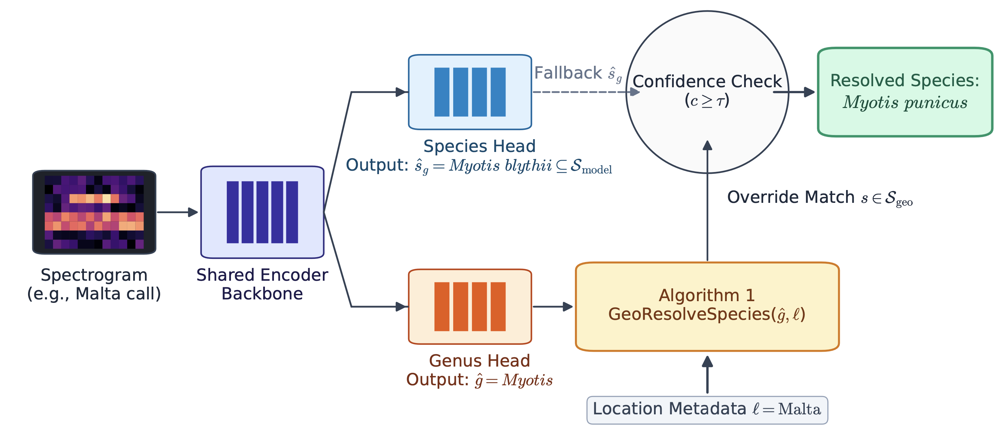

# ChiroEcho: extending automated bat vocalisation classification beyond the learned taxonomy



**ChiroEcho** is a deep learning framework for automated classification of European bat echolocation calls. It jointly predicts species and genus from a shared acoustic encoder, and combines genus-level predictions with regional species distributions at inference time. When only one species of a predicted genus occurs at a recording's location, the framework resolves the prediction to that species — including species that were absent from the training taxonomy entirely.

Trained on 35 European bat species from [ChirosetEurope](https://doi.org/10.5281/zenodo.20773226), ChiroEcho extends operational coverage to 41 of the 48 native European bat species (73% → 85%), which to our knowledge is the broadest operational coverage reported for automated European bat classification to date.

This reframes geographic information as a means of *extending* a classifier's effective taxonomy, rather than merely constraining predictions within a fixed one.

**This repository is currently a placeholder.** Training and inference code will be added here in due time. In the meantime, this page describes the method and provides the citation for the associated workshop paper.

## Method overview

ChiroEcho uses a shared EfficientNet-B3 acoustic encoder with two linear heads — species (35 classes) and genus (11 classes) — trained jointly with a multi-label binary cross-entropy objective. At inference, a lightweight rule-based post-processing step (`GeoResolveSpecies`) combines high-confidence genus predictions with a region–genus lookup table: when a genus has exactly one representative species in the recording's region, the genus prediction is resolved to that species, overriding the species head. This mechanism requires no additional training and can recover species entirely absent from the learned taxonomy, provided their genus is acoustically resolvable and they are the sole regional representative of that genus.

## Status

- [x] Paper accepted (CV4Ecology workshop, ECCV 2026)
- [ ] Training code
- [ ] Inference / geographic resolution code
- [ ] Pretrained model weights

## Citing this work

If you use ChiroEcho or refer to this work, please cite:

```bibtex
@inproceedings{ghani2026chiroecho,
  title     = {ChiroEcho: extending automated bat vocalisation classification beyond the learned taxonomy},
  author    = {Ghani, Burooj and Eversteijn, Welmoed and van Hirtum, Milan and Ca{\~n}as, Juan Sebasti{\'a}n 
               and Kalkman, Vincent J. and Stowell, Dan and Baier, A. Leonie},
  booktitle = {CV4Ecology Workshop, European Conference on Computer Vision (ECCV)},
  year      = {2026}
}
```

## Related resources

- **Dataset**: [ChirosetEurope](https://doi.org/10.5281/zenodo.20773226) — a curated bioacoustics dataset of European bat vocalisations
- **Affiliation**: [Naturalis Biodiversity Center](https://www.naturalis.nl/)

## About

No description, website, or topics provided.
